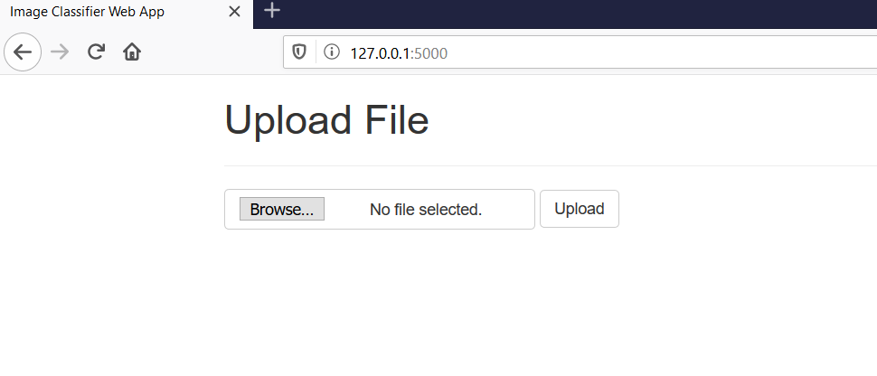
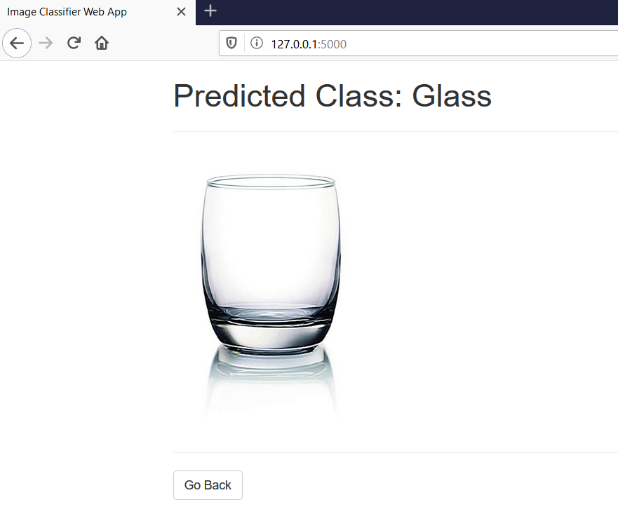

# Image Classifier Web App

Image classifier web app template to deploy a `tf.keras` model using Flask.

The model used in this example was then trained to distinguish between images of glass and tables. The dataset used is Glasses vs Tables by [Muhammed Buyukkinaci](https://github.com/MuhammedBuyukkinaci).

## Setup

Clone the repository

`git clone https://github.com/am1tyadav/Image-Classifier-Web-App.git`

Change directory

`cd Image-Classifier-Web-App`

Create virtual environment

`python -m venv venv`

Activate virtual environment (Windows)

`venv\Scripts\activate`

Activate virtual environment (Mac / Linux)

`source venv/bin/activate`

Install the requirements

`python -m pip install -r requirements.txt`

Run the app

`python app.py`

Since the model was trained on images of glass or tables, you should ideally upload images of either glass or table and hopefully, the model will be able to predict accurately.

## Upload a file

## Get a prediction

